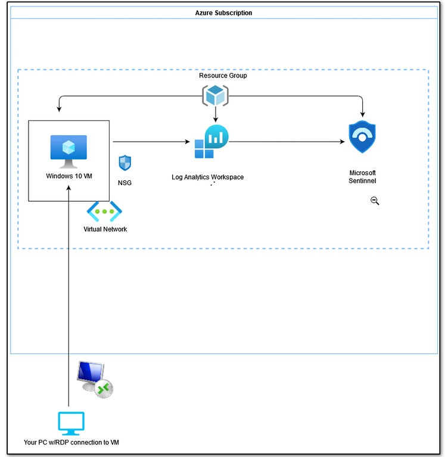
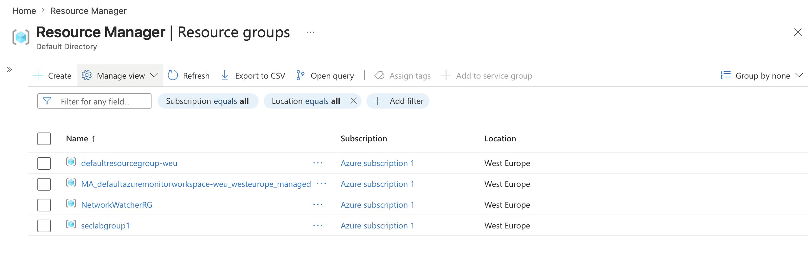
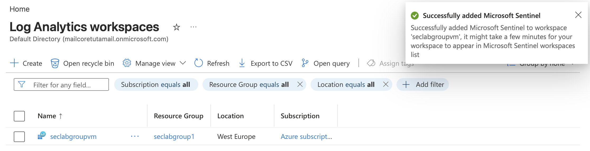
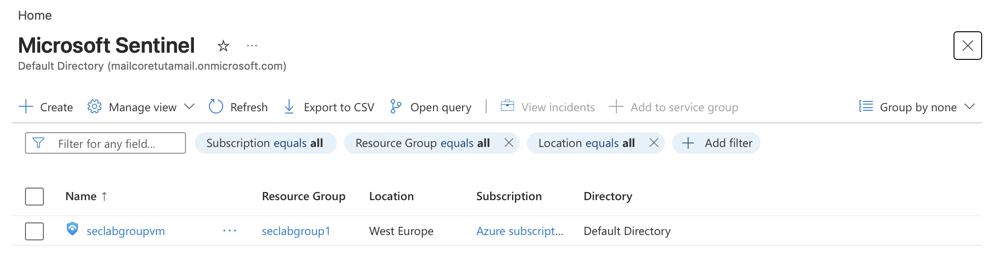
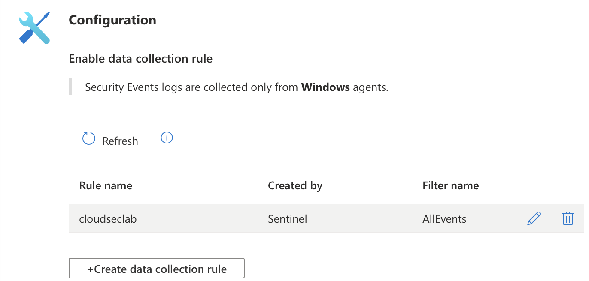
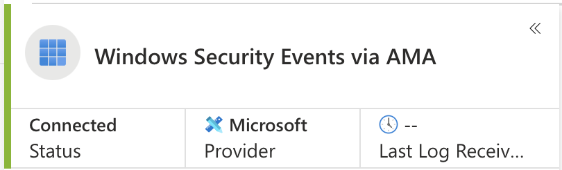
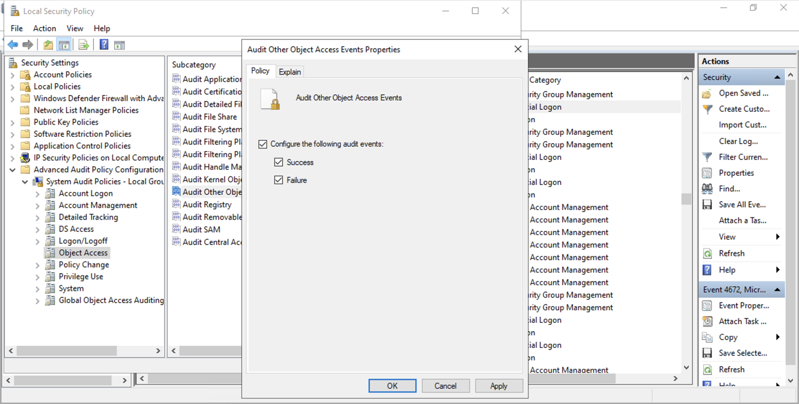
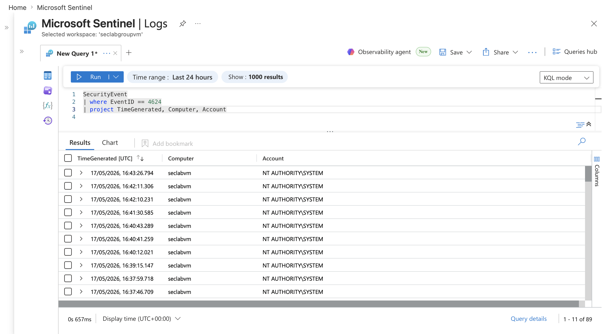

# Azure Environment Setup

### Overview

This section establishes the Azure environment used across the Azure Security Lab. It provides the foundational infrastructure for logging, monitoring, and security detection using Microsoft Sentinel and Defender for Cloud.

The environment supports:

- centralised logging
- cloud security monitoring
- endpoint telemetry collection
- threat detection
- incident response workflows
- future attack simulation scenarios

This setup serves as the base platform for the Sentinel SOC, Defender for Cloud monitoring, identity security testing, and incident response labs contained in this repository.

---

## Objectives

This lab focuses on:

- Configuring foundational Azure security resources
- Deploying and configuring Log Analytics Workspace
- Enabling Microsoft Sentinel for SIEM monitoring
- Connecting Azure Virtual Machine telemetry
- Integrating security data connectors
- Configuring Windows logging and auditing
- Validating telemetry ingestion using KQL
- Preparing the environment for future detection engineering and threat hunting labs

---

## Architecture

---

## Environment Deployment

### 1. Azure Resource Configuration

Configure core Azure resources required for the security lab environment.

### 2. Log Analytics Workspace

Deploy a Log Analytics Workspace for centralised log ingestion and retention.

**Notes:** 
- *Log Analytics workspaces are essential for collecting, storing, and analysing log data from different sources to provide security insights and help detect threats.*
- *Sometimes called Microsoft Sentinel Workspace once Microsoft Sentinel is enabled on it*

### 3. Microsoft Sentinel Enablement

Enable Microsoft Sentinel for SIEM-based monitoring and detection.

**Notes:**

*Microsoft SOC Teams are assigned specific roles and permissions. 
Each team member is assigned either or a combination of these roles to perform their daily tasks*:

- **Microsoft Sentinel Reader** Stakeholders, SOC managers,etc
- **Microsoft Sentinel Responder** Security analysts L1, incident responders
- **Microsoft Sentinel Contributor** Security engineers L2, Fusion Analytics team members
  - Install and manage Solutions using Content Hub
  - Create and delete workbooks

- **Microsoft Sentinel Playbook Operator** Security analysts L1, Automation team members
  - Automate responses to threats with playbooks

### 4. Data Connector Integration

Configure data connectors to ingest security telemetry from Azure and Windows sources.

### 5. Virtual Machine Telemetry

Validate that the Azure VM is sending security logs to Log Analytics.

### 6. Windows Security Logging

Enable Windows auditing policies for security event generation.

### 7. KQL Validation

Run KQL queries to confirm log ingestion and visibility.

---

## Outcome

This environment provides a centralised Azure security monitoring platform capable of supporting:

- detection engineering
- threat hunting
- cloud monitoring
- identity security analysis
- incident response simulations
- SOC investigation workflows
