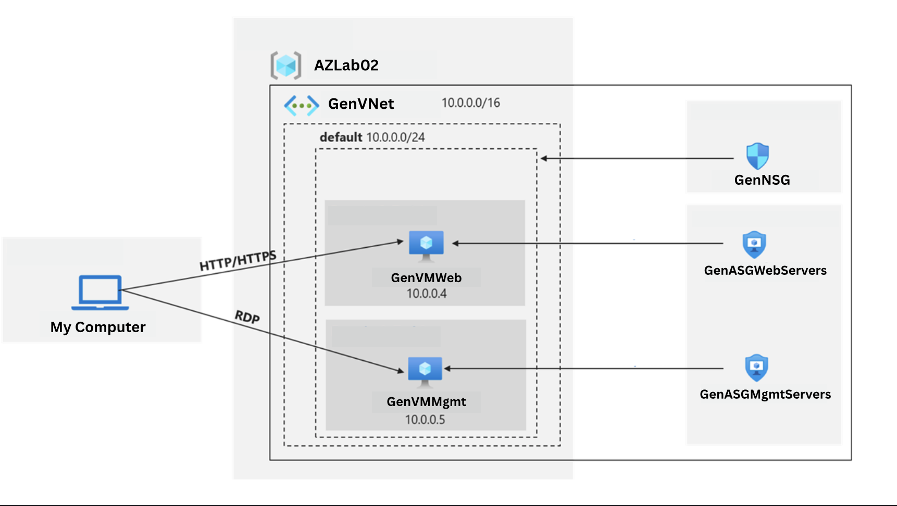
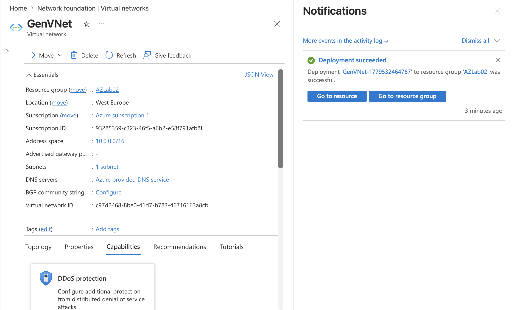
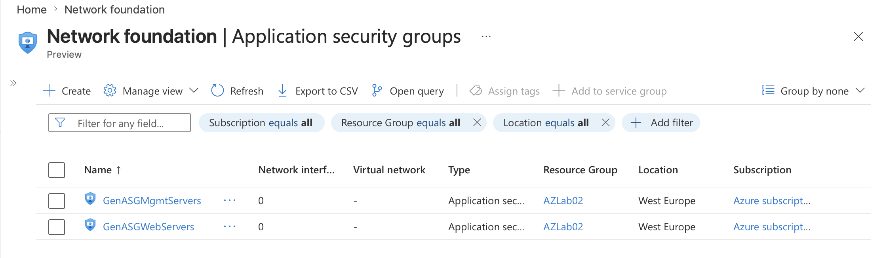
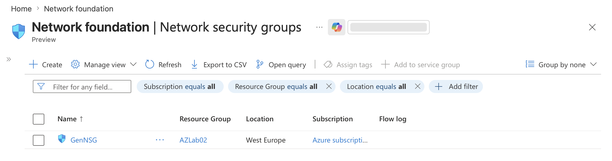
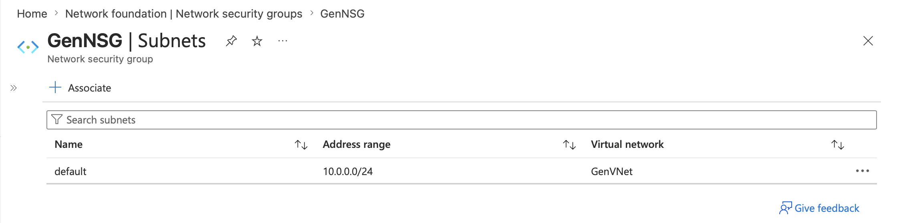
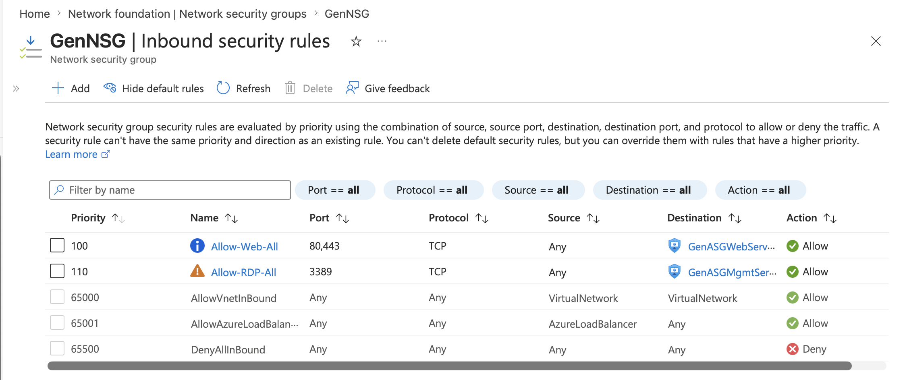
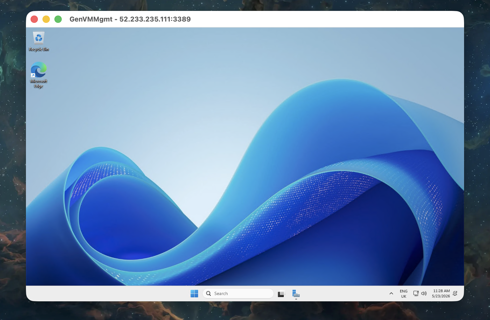
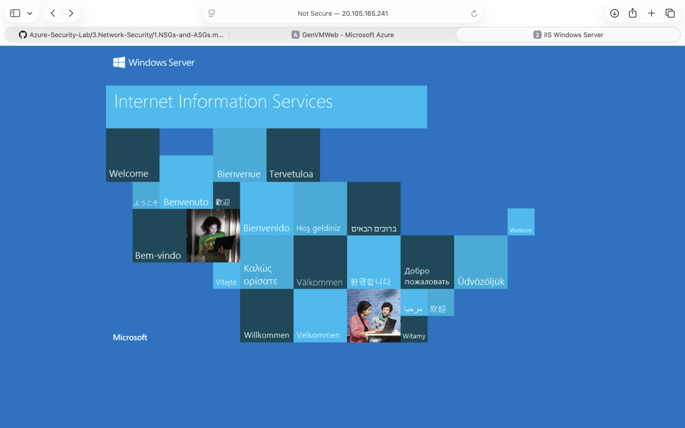

# Design and Secure Azure Network Infrastructure
## Objective

The aim of this repo is to secure Azure network access with Network security groups (NSGs) and Application security groups (ASGs) by isolating the environment that connects both devices & servers and segmentating the networks into smaller isolated sub-sections. Combining both of these techniques greatly improves network security by limiting the blast radius of cyberattacks reducing network congestion and simplifying compliance.

---

## Network and Application Security Groups diagram

## Implementation (Security Controls)

- Create a virtual network with one subnet to simplify network management, centralised access control, enhance routing efficiency and improve network security.

- Create two application security groups to enforce security policies based on logical groupings.

- Create a network security group and associate it with the virtual network subnet.

- Implement inbound NSG security rules to all traffic to web servers and RDP to the management servers.

  

---

## Architecture Decisions

---

## Validation

Test the network traffic filters by RDP´ing into the GenVMMgmt virtual machine and hopefully be able to connect from the internet to the GenVMWeb virtual machine and view the default Internet Information Service (IIS) web page.

---

## Key Learnings
