# Azure Firewall Deployment

## Objective

Deploy an Azure firewall to control inbound and outbound network access which is an important part of our overall network security posture.

---

## Azure Firewall Diagram

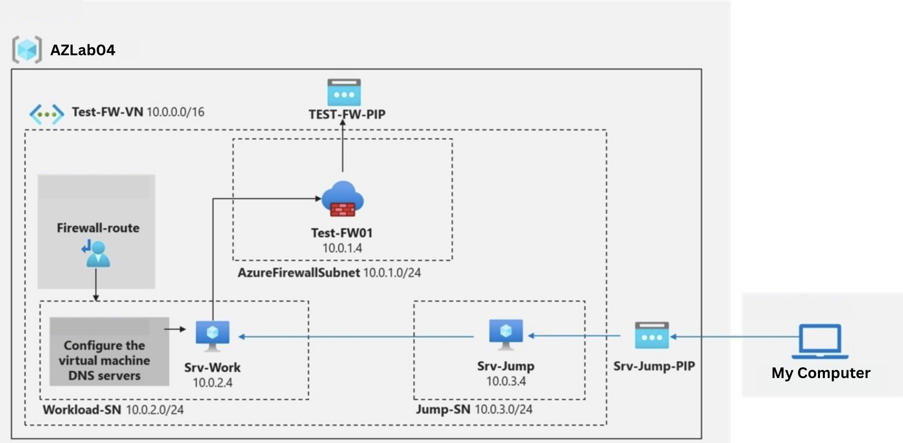

___

## Implementation (Security Controls)

- Deploy an Azure firewall.

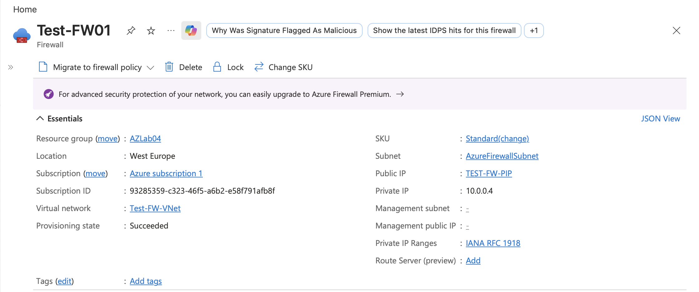

- Create a default route.

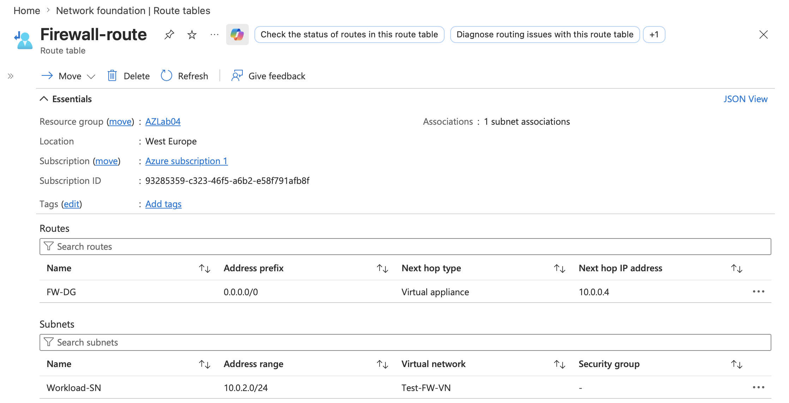

- Configure an application rule.

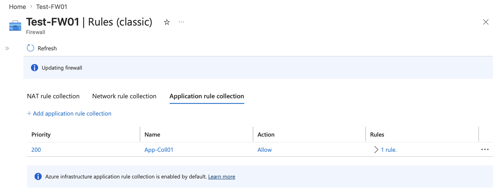

- Configure a network rule.

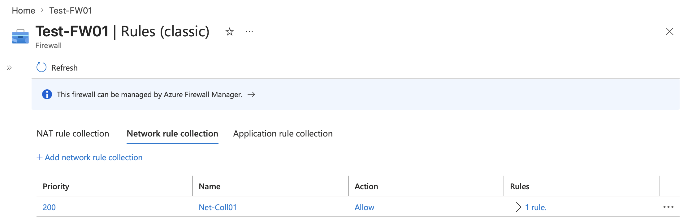

- Configure DNS servers.

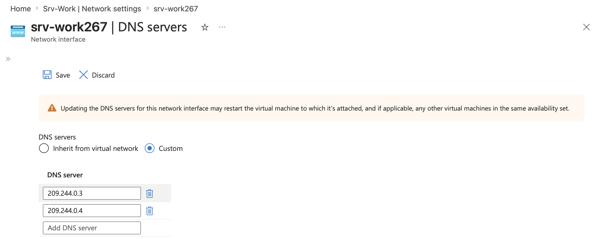

---

## Architecture Decisions

- Implement an Azure Firewall for intrusion protection/prevention, traffic control, and scalability.
- Creat a default route to direct unmatched traffic to the internet, firewall, or VPN.
- Add application rules to allow or block traffic to specific applications, websites, and domains.
- Add network rules to control traffic using IP addresses, ports, and protocols.
- Configure DNS Servers to translate domain name (e.g bing.com, microsoft.com) in IP addresses for connectivity.

---

## Validation

Test the firewall is working by connecting to the Srv-Jump virtual machine using Remote Desktop, then connect from Srv-Jump to Srv-Work. On Srv-Work, open Internet Explorer and confirm that bing.com loads successfully while microsoft.com is blocked with a deny message. This confirms the firewall rules are working correctly.

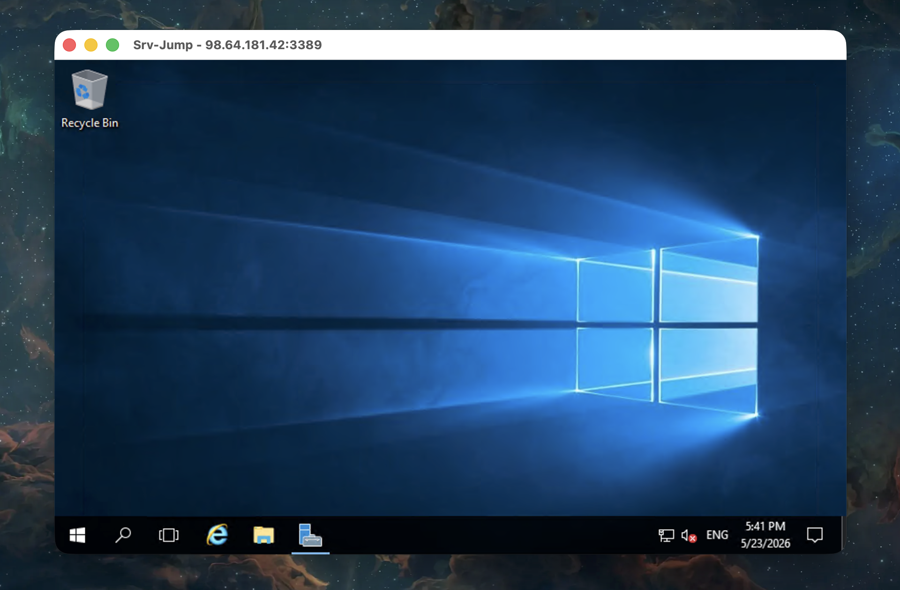

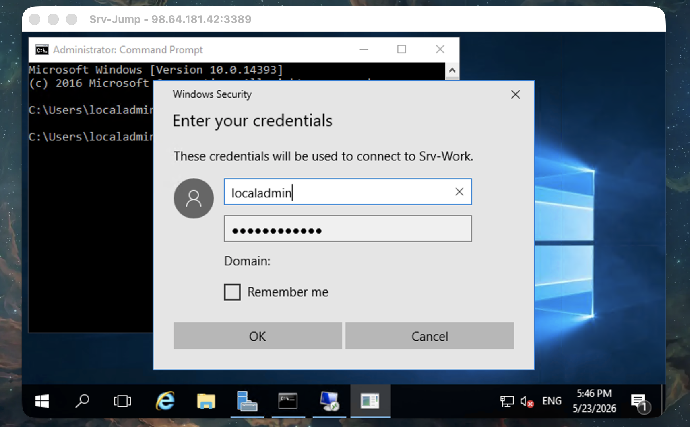

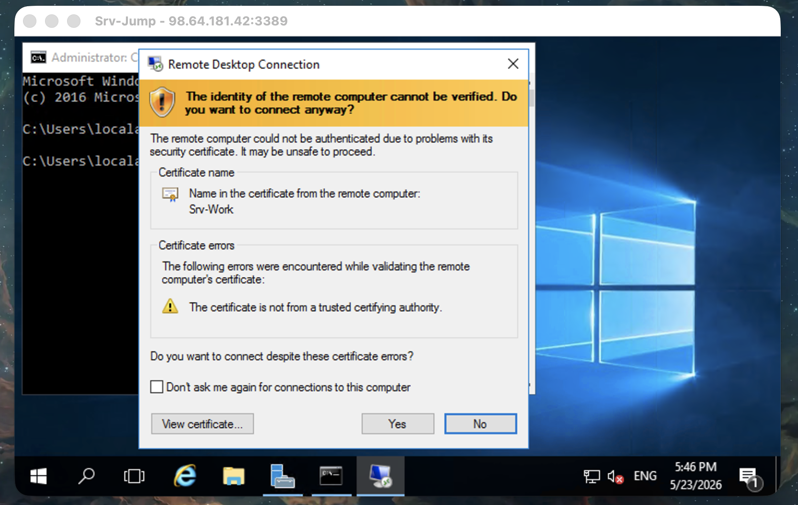

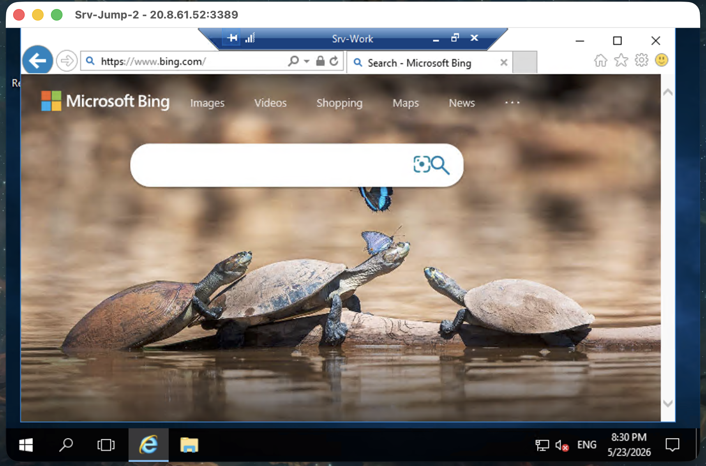

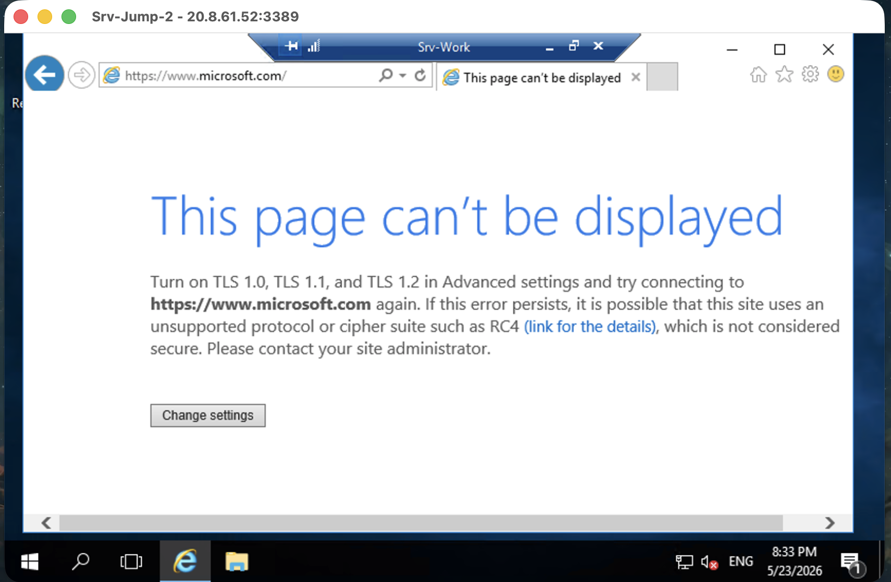

---

## Key Learnings
