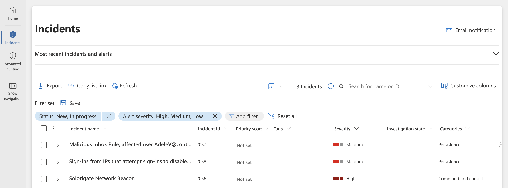

# Microsoft Sentinel Detection & Investigation

## Overview 

This project demonstrates how Microsoft Sentinel is used in a SOC environment to detect and investigate security threats. It covers Analytics Rules, incident triage, threat hunting, and KQL-based investigations to validate alerts, correlate events, and understand attacker activity.

---

## Problem

Microsoft Sentinel raised a medium-severity incident after detecting repeated sign-in attempts from an external IP address against disabled accounts.

---

## Azure Services Used

- Microsoft Sentinel (SIEM) — log correlation, IOC analysis, investigation
- Log Analytics Workspace — data aggregation analysis
- Microsoft Entra ID (Azure AD) — identity and sign-in log correlation
- Azure Monitor — log visibility and telemetry

---

## Investigation Summary

Assumed ownership of a high-severity incident titled **"Sign-ins from IPs that attempt sign-ins to disabled accounts"** for investigation. The incident contained several alerts that indicated repeated sign-in attempts against disabled accounts, and I needed to determine if it was a genuine security risk.

To determine the scope and severity of the activity, incident details were reviewed, including associated alerts, entities, timestamps, event counts, and mapped MITRE ATT&CK techniques. This helped me understand what had triggered the incident and identify the areas that required further investigation.

During the review, I identified authentication attempts originating from suspicious IP addresses that was targeting disabled user accounts. To better understand the activity, I analysed the incident timeline and examined how the events were related.

> **Screenshot:** Incident Timeline Analysis

To validate the alerts, I pivoted into Log Analytics and reviewed the underlying authentication and security logs. I focused on the Source IP address, affected accounts, authentication outcomes, and any related events that could give additional information.

> **Screenshot:** Log Analytics Query Results

Next, I investigated the entities aasociated with the incident, including the suspicious IP address and affected accounts. By reviewing entity information and geolocation data, I was able to build a career picture of the activity and assess whether it aligned with expected behaviour.

> **Screenshot:** Entity Investigation and IP Details

After correlating the available evidence across alerts, logs, and entities, I concluded that the activity required further investigation. I documented my findings, created an escalation task summarising the actions taken, and escalated the incident to the SOC Level 2 team for deeper analysis and threat hunting.

> **Screenshot:** Escalation Task / Incident Assignment to SOC Level 2

---

## Key Findings (IOCs & Evidence)

| IOC Type | Evidence | Relevance |
|-----------|-----------|------------|
| Source IP Address | 175.45.176.99 | Generated multiple authentication attempts |
| User Account | Disabled account(s) | Targeted during sign-in attempts |
| Alert Name | Sign-ins from IPs that attempt sign-ins to disabled accounts | Triggered due to suspicious authentication activity |
| Authentication Events | Multiple failed sign-in attempts | Required further investigation |
| Geolocation Data | External location | Used to provide context for the activity |

---

## Security Improvements / Recommendations

- Continue monitoring authentication activity associated with the identified IP address.
- Perform additional threat hunting to determine whether similar activity exists elsewhere in the environment.
- Review controls and monitoring related to disabled user accounts.
- Investigate whether the source IP address is associated with known malicious activity.
- Consider enriching authentication alerts with IP reputation data to improve future investigations.
- Regularly review and tune detection rules to ensure suspicious authentication activity is identified quickly.

---

## Key Learnings

- Configured and customised Microsoft Sentinel Analytics Rules to generate and investigate security alerts.
- Worked with rule severity, scheduling, data sources, and MITRE ATT&CK mappings to support threat detection.
- Investigated, triaged, and classified security incidents in a simulated SOC environment.
- Managed incidents through to closure, documenting findings and escalating more complex cases for further investigation.
